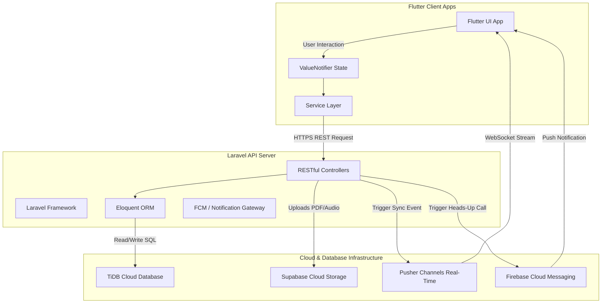

# 🚀 RupiaChat API - System Architecture & Documentation

Selamat datang di repositori backend **RupiaChat API**. Dokumen ini menjelaskan secara rinci tentang arsitektur sistem, pola desain, integrasi cloud, dan teknologi yang kita gunakan di seluruh ekosistem RupiaChat (Flutter Client & Laravel API Backend).

---

## 🏗️ Gambaran Arsitektur Sistem (System Architecture)

RupiaChat menggunakan arsitektur **Client-Server** modern dengan komunikasi berbasis **RESTful API** untuk transaksi data dan protokol **WebSockets / Event-Driven** untuk sinkronisasi waktu-nyata (*real-time*).



---

## 📱 1. Arsitektur Sisi Klien (Flutter Client Architecture)

Pada aplikasi Flutter, kita menerapkan pola **Layered Architecture (Arsitektur Berlapis)** untuk memisahkan logika bisnis dari UI:

### A. Pola Desain (Design Patterns)
*   **Service Layer Pattern**: Seluruh komunikasi API didekapsulasi ke dalam kelas layanan terisolasi seperti `AuthService`, `ChatService`, `GroupService`, `PurchaseService`, `SupabaseStorageService`, dan `CallApiService`.
*   **Reactive State Management**: Menggunakan **`ValueNotifier`** dan **`ValueListenableBuilder`** yang ringan untuk pembaruan UI real-time (seperti pengetikan, perubahan warna palet tema, indeks navigasi, dll.) tanpa overhead dari package berat.
*   **Model-Driven Architecture (Serialization)**: Setiap payload JSON dari backend dipetakan secara ketat (*type-safe*) ke dalam model Dart seperti `UserModel`, `MessageModel`, `GroupModel`, dan `GroupMessageModel`.

### B. Integrasi Perangkat & Fitur Utama
*   **Real-Time VoIP & Video Call**: Menggunakan **Agora RTC SDK** (`agora_rtc_engine`) dikombinasikan dengan `flutter_callkit_incoming` untuk heads-up call native.
*   **Voice Note Recording & Playback**: Ditenagai oleh **`record`** untuk kompresi audio AAC-LC lokal ke format `.m4a` dan **`audioplayers`** untuk pemutaran audio interaktif.
*   **Dynamic Theme Palettes**: Manajemen skema warna mutable (`RupiaColors.primary`) yang disimpan secara lokal di `SharedPreferences` dan diperbarui di seluruh aplikasi via `AnimatedTheme` tanpa restart aplikasi.

---

## 💻 2. Arsitektur Sisi Server (Laravel API Backend Architecture)

Backend dibangun di atas framework **Laravel** dengan arsitektur **MVC (Model-View-Controller)** yang disesuaikan khusus untuk melayani API (*API-only application*):

### A. Pola Desain & Logika Bisnis
*   **RESTful Controllers**: Controllers terorganisasi secara modular untuk menangani resource obrolan (`MessageController`, `GroupMessageController`), manajemen grup (`GroupController`), otentikasi (`UserController`), dan modul premium (`PurchaseController`).
*   **Self-Healing Ngrok / Media URLs Helper**: Kami menggunakan logika dinamis untuk mendeteksi *base URL* request aktif (termasuk domain dinamis Ngrok) untuk menulis ulang berkas media lokal secara otomatis sebelum JSON dikirim ke Flutter, menjamin tidak ada tautan gambar/audio yang rusak (*broken link*).
*   **Form Request Validation**: Proteksi ketat terhadap payload masukan, membatasi format berkas seperti PDF dan Audio (AAC/MP3) hingga ukuran maksimum 10MB.

---

## ☁️ 3. Infrastruktur & Integrasi Cloud (Cloud Integration)

RupiaChat memanfaatkan keunggulan multi-cloud untuk efisiensi performa dan keandalan data:

1.  **TiDB Cloud (Relational Database)**:
    *   Menggunakan basis data **TiDB Cloud (MySQL compatible)** yang didistribusikan secara global dengan performa transaksi ACID tinggi pada port `4000`, menjamin penyimpanan data obrolan, kontak, dan transaksi yang konsisten dan aman.
2.  **Supabase Storage (Media Bucket)**:
    *   Berkas lampiran premium (Gambar, PDF, Audio) diunggah langsung ke *bucket* Supabase melalui SDK, mengembalikan tautan publik permanen untuk mengurangi beban bandwidth pada server utama.
3.  **Real-Time WebSockets Gateway (Pusher / Supabase)**:
    *   Mengalirkan status aktif pengguna, indikator sedang mengetik (*typing indicators*), centang dua tanda baca (*read receipts*), dan pesan baru langsung secara instan tanpa proses polling (*polling-free*).
4.  **Firebase Cloud Messaging (FCM Gateway)**:
    *   Memicu notifikasi *push* latar belakang berprioritas tinggi (*high-priority background notification*) untuk membangunkan aplikasi penerima saat ada panggilan telepon Agora masuk.

---

## 🛠️ Panduan Pengembangan Lokal (Local Development)

### Persyaratan Sistem (Prerequisites)
*   PHP `>= 8.2`
*   Composer `>= 2.0`
*   MySQL / TiDB Client

### Menjalankan Server API Lokal
1.  Salin konfigurasi lingkungan:
    ```bash
    cp .env.example .env
    ```
2.  Instal dependensi PHP:
    ```bash
    composer install
    ```
3.  Jalankan migrasi database:
    ```bash
    php artisan migrate
    ```
4.  Jalankan server pengembangan:
    ```bash
    php artisan serve
    ```
