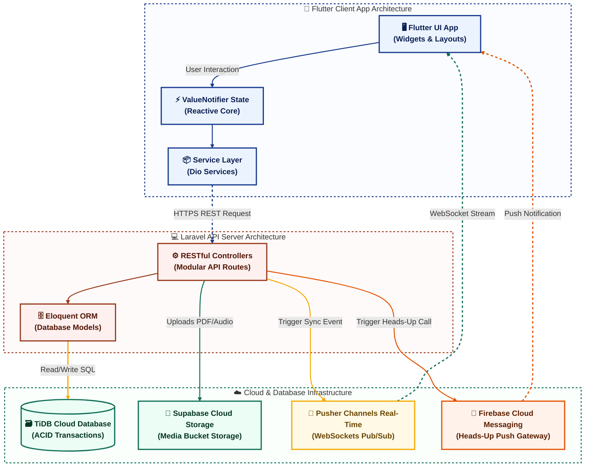
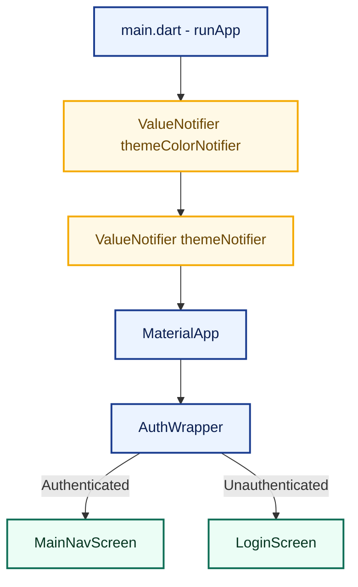

# 🚀 RupiaChat API - System Architecture & Documentation

Selamat datang di repositori backend **RupiaChat API**. Dokumen ini menjelaskan secara rinci tentang arsitektur sistem, pola desain, integrasi cloud, dan teknologi yang kita gunakan di seluruh ekosistem RupiaChat (Flutter Client & Laravel API Backend).

---

## 🏗️ Gambaran Arsitektur Sistem (System Architecture)

RupiaChat menggunakan arsitektur **Client-Server** modern dengan komunikasi berbasis **RESTful API** untuk transaksi data dan protokol **WebSockets / Event-Driven** untuk sinkronisasi waktu-nyata (*real-time*).



---

## 🎨 1. Arsitektur Sisi Klien & Preview Kode (Flutter Client Structure)

Struktur kode aplikasi Flutter diatur menggunakan **Layered Architecture** dengan fokus penuh pada pemisahan state, UI, dan komunikasi server.

### A. Widget Tree & State Flow Visual Preview
Berikut adalah representasi visual bagaimana state dinamis disebarkan dari level teratas (`MaterialApp`) hingga ke Widget terkecil secara reaktif:



### B. Implementasi Nyata Pola Reactive State Management
Aplikasi menggunakan **`ValueNotifier`** untuk performa optimal tanpa pustaka eksternal yang berat. Contoh di bawah menunjukkan bagaimana warna tema primer (`RupiaColors.primary`) dimutasi dan didengarkan secara real-time di `lib/main.dart`:

```dart
// Mendefinisikan Notifier Global di main.dart
final ValueNotifier<Color> themeColorNotifier = ValueNotifier(RupiaColors.primary);

// Menghubungkan ke UI Root MaterialApp menggunakan ValueListenableBuilder
class RupiaChatApp extends StatelessWidget {
  const RupiaChatApp({super.key});

  @override
  Widget build(BuildContext context) {
    return ValueListenableBuilder<Color>(
      valueListenable: themeColorNotifier,
      builder: (context, primaryColor, child) {
        return MaterialApp(
          title: 'RupiaChat',
          theme: ThemeData(
            colorScheme: ColorScheme.fromSeed(seedColor: primaryColor),
            useMaterial3: true,
          ),
          routes: {
            '/': (context) => const AuthWrapper(),
            '/login': (context) => const LoginScreen(),
            '/home': (context) => const MainNavScreen(),
          },
        );
      },
    );
  }
}
```

### C. Implementasi Nyata Pola Service Layer (Pusher Event Stream)
Seluruh API terenkapsulasi ke dalam kelas layanan terisolasi. Di bawah ini adalah cuplikan visual bagaimana `ChatService` memetakan **Pusher WebSocket Event** ke dalam **Dart Stream** reaktif yang dikonsumsi oleh UI untuk memperbarui daftar chat:

```dart
class ChatService {
  static final ChatService _instance = ChatService._internal();
  factory ChatService() => _instance;
  
  static final _pusher = PusherChannelsFlutter.getInstance();
  static final StreamController<PusherEvent> _globalEventController = StreamController<PusherEvent>.broadcast();

  // Mendengarkan pesan masuk secara real-time berdasarkan channel chat
  Stream<MessageModel> listenMessages(String roomId) {
    final channelName = 'chat.$roomId';
    
    // Auto-subscribe channel jika belum terdaftar
    _subscribeIfNew(channelName);

    return _globalEventController.stream
        .where((event) => event.channelName == channelName)
        .where((event) => event.eventName == 'MessageSent' || event.eventName == 'App\\Events\\MessageSent')
        .map((event) {
          final data = jsonDecode(event.data);
          return MessageModel.fromMap(data['message'], data['message']['id'].toString());
        });
  }
}
```

---

## 💻 2. Arsitektur Sisi Server (Laravel API Backend Architecture)

Backend dibangun di atas framework **Laravel** dengan fokus melayani API (*API-only application*) dengan struktur endpoint bersih dan keamanan tinggi.

### A. Proteksi Masukan & Alur Validasi
*   **Form Request Validation**: Proteksi ketat terhadap payload masukan, membatasi berkas seperti PDF dan Audio (AAC/MP3) hingga ukuran maksimal 10MB.
*   **Self-Healing Ngrok / Media URLs Helper**: Laravel mendeteksi *base URL* aktif (termasuk domain dinamis Ngrok) untuk menulis ulang berkas media lokal secara otomatis sebelum JSON dikirim ke Flutter, menjamin tidak ada tautan gambar/audio yang rusak (*broken link*).

---

## ☁️ 3. Infrastruktur & Integrasi Cloud (Cloud Integration)

RupiaChat memanfaatkan keunggulan multi-cloud untuk efisiensi performa dan keandalan data:

1.  **TiDB Cloud (Relational Database)**:
    *   Menggunakan basis data **TiDB Cloud (MySQL compatible)** yang didistribusikan secara global dengan performa transaksi ACID tinggi pada port `4000`, menjamin penyimpanan data obrolan, kontak, dan transaksi yang konsisten dan aman.
2.  **Supabase Storage (Media Bucket)**:
    *   Berkas lampiran premium (Gambar, PDF, Audio) diunggah langsung ke *bucket* Supabase melalui SDK, mengembalikan tautan publik permanen untuk mengurangi beban bandwidth pada server utama.
3.  **Real-Time WebSockets Gateway (Pusher)**:
    *   Mengalirkan status aktif pengguna, indikator sedang mengetik (*typing indicators*), centang dua tanda baca (*read receipts*), dan pesan baru langsung secara instan tanpa proses polling (*polling-free*).
4.  **Firebase Cloud Messaging (FCM Gateway)**:
    *   Memicu notifikasi *push* latar belakang berprioritas tinggi (*high-priority background notification*) untuk membangunkan aplikasi penerima saat ada panggilan telepon Agora masuk.

---

## 🛠️ Panduan Pengembangan Lokal (Local Development)

### Persyaratan Sistem (Prerequisites)
*   PHP `>= 8.2`
*   Composer `>= 2.0`
*   MySQL / TiDB Client

### Menjalankan Server API Lokal
1.  Salin konfigurasi lingkungan:
    ```bash
    cp .env.example .env
    ```
2.  Instal dependensi PHP:
    ```bash
    composer install
    ```
3.  Jalankan migrasi database:
    ```bash
    php artisan migrate
    ```
4.  Jalankan server pengembangan:
    ```bash
    php artisan serve
    ```
